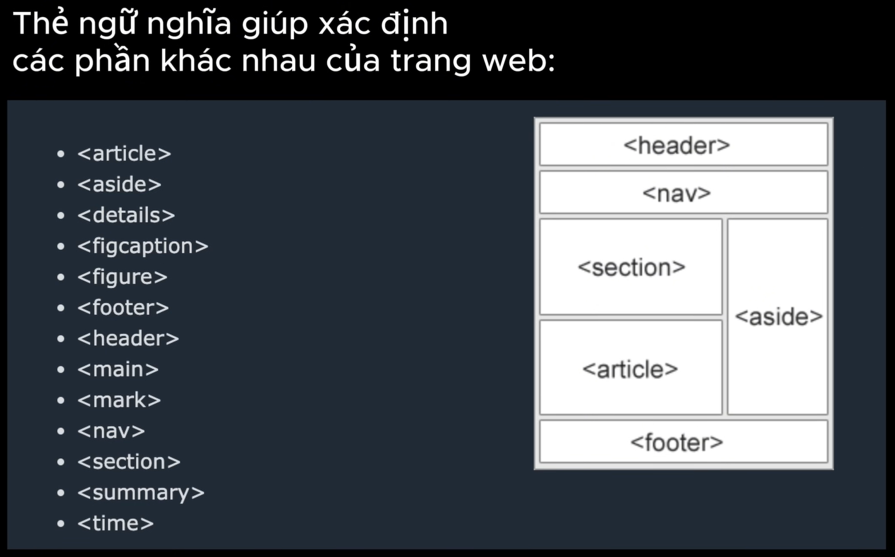

# cấu trúc 1 trang html, những kiến thức cơ bản

hiển thị tất cả nội dung trên vscode Alt + z

 

gõ dấu chấm cảm ! sau đó nhấm tab ==> cấu trúc đơn giản nhất của html

<!DOCTYPE html> //version mới nhất
<html lang="en"> //thẻ html-root element phần tử gốc- khai báo sự bắt đầu kết thúc của 1 trang html
<head> //chứa thông tin cấu hình và mô tả web, 0 hiển thị trực tiếp cho user
    <meta charset="UTF-8"> //hỗ trợ hiển thị đa ngôn ngữ
    <meta name="viewport" content="width=device-width, initial-scale=1.0"> //hiển thị đúng trên mọi thiết bị 
    <title>Document</title>
</head>
<body>
    
</body>
</html>

# _các thể loại thẻ_

## thẻ tiêu đề, header

<h></h> //có h1 h2 h3 ... giúp browser hiểu nội dung trang web tốt hơn. sử dụng đúng thứ tự cấp bậc là quan trọng

## chú thích - ctr + /

<!--  -->

## thẻ đoạn văn - p-paragraph

    

    <b></b> in đậm
    <i></i> italics in nghiêng
    <u></u> underscore gạch chân

## thẻ liên kết - anchor link

<a href="https://google.com" title="gu gồ" target="blank" rel="noreferrer noopener">Google</a>

thẻ liên kết có 1 thuộc tính bắt buộc là " href
target="blank" mở ở cửa sổ mới
rel= relation để tăng bảo mật giữa 2 trang web

## thẻ hình ảnh, video, âm thanh - image

## thẻ list

<ol type="1"> //odered list Type có thể mang giá trị: 1, a, A, I, i
    <li></li> /list item
    <li></li> 
    <li></li> 
</ol> 
--------------

<ul type="none"> type có thể mang các giá trị như none, circle, dist, square
    <li></li> /list item
    <li></li> 
    <li></li> 
</ul> 
--------------------------
<dl> 
    <li></li> /list item
    <li></li> 
    <li></li> 
</dl>

## thẻ table

<table> //kiểu đơn giản nhất
    <caption> </caption>
    <tr>
        <th></th>
        <th></th>
        <th></th>
    </tr>
    <tr>
        <td></td>
        <td></td>
        <td></td>
    </tr>
</table>

<table>// nâng cao hơn 1 chút
      <colgroup>
        <!-- colgroup là để nhóm, col bắt buộc phải nằm trong colgroup -->
        <col style="background-color: #ffffff" span="2" />
        <col style="background-color: rgb(255, 255, 187)" span="2" />
      </colgroup>
      <thead>
        <tr>
          <th scope="col" rowspan="2"></th>
          <th scope="col" rowspan="2"></th>
          <th scope="col" colspan="2"></th>
        </tr>
        <tr>
          <th scope="col"></th>
          <th scope="col"></th>
        </tr>
      </thead>
      <tbody>
        <tr>
          <th scope="row"></th>
          <td></td>
          <td></td>
          <td></td>
        </tr>
        ........
      </tbody>
      <tfoot>
        <tr>
          <th scope="row" colspan="2"></th>
          <td></td>
          <td></td>
        </tr>
      </tfoot>
    </table>

## thẻ form

<form action=""> //thuộc tính action-liên quan đến backend
      <label for=""></label>
    <input type="text" />     // ô nhập văn bản
    <button type="submit">Đăng nhập</button> // còn có nhiều type như reset,....
</form>

## thẻ div

Mục đích: Chia bố cục, gom các phần nội dung lớn (header, section, card…).
Đặc điểm: Block-level, chiếm cả dòng, tự xuống dòng.
Ví dụ:

  <h2>Tiêu đề</h2>
  
Nội dung

## span

Mục đích: Bọc một phần nhỏ nội dung để style hoặc xử lý riêng.
Đặc điểm: Inline, không chiếm cả dòng, không xuống dòng.
Ví dụ:

Giá: 100.000đ

👉 Nhớ nhanh: div để chia khối, span để style chi tiết.

## Semantic HTML

giúp code dễ đọc, tăng seo (Search Engine Optimization)

